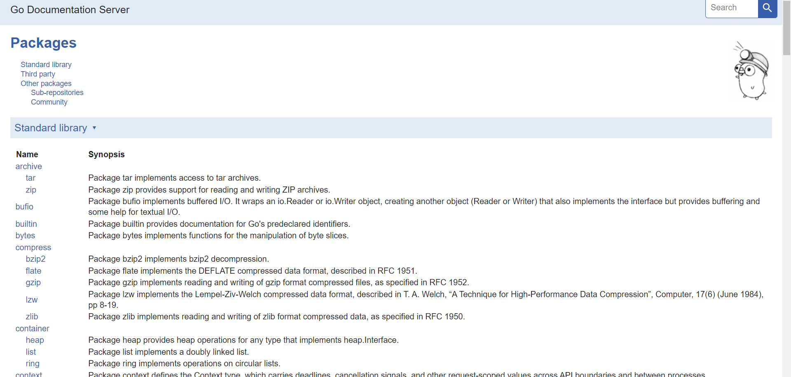
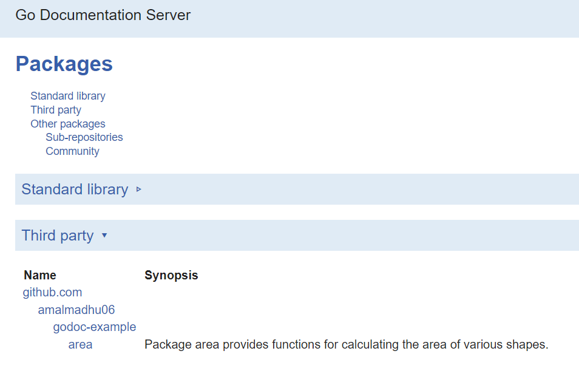
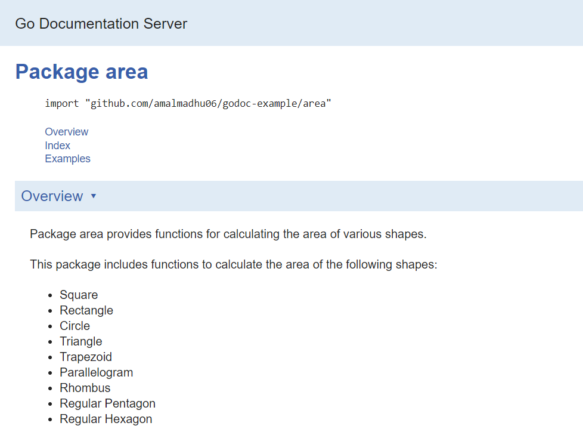
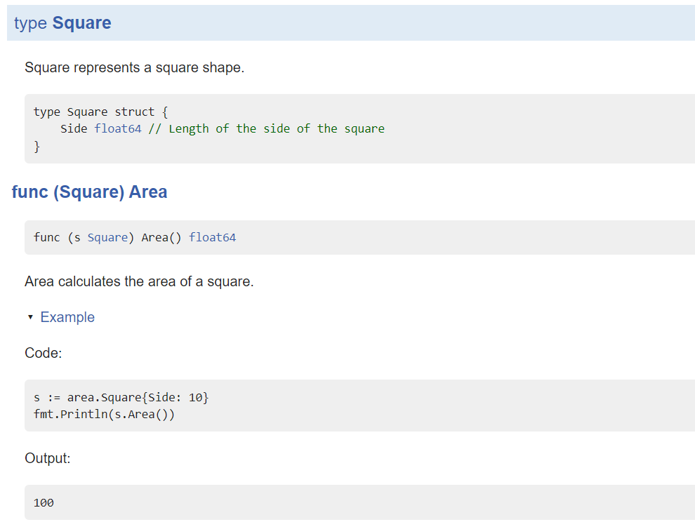

# How to use godoc to generate documentation?
**godoc** is a documentation tool for Go programming language that automatically generates documentation from code comments. Its three advantages are:
1. Easy Accessibility: GoDoc provides a web-based interface that allows easy access to package documentation.
2. Self-Contained Documentation: Documentation is generated directly from code comments, ensuring that it stays up-to-date and remains in sync with the codebase.
3. Integration with Go Ecosystem: GoDoc integrates seamlessly with the Go ecosystem, making it a standard tool for developers to document and share their packages.

## Install godoc
1. Ensure that you have Go installed on your system. If not, download and install it from the official Go website (https://golang.org).
2. Open your terminal or command prompt.
3. Use the following command to install GoDoc
```shell
go install golang.org/x/tools/cmd/godoc@latest
```
This command will download and install the GoDoc tool and its dependencies.
4. Wait for the installation to complete. GoDoc will be installed in your Go bin directory.
5. Verify the installation by running the following command:
```shell
godoc -h
```
If GoDoc is successfully installed, you should see the help information for the GoDoc command.

## Writing documentation

godoc uses comments for generating documentation.

Let's create a new project and see how can we write documentation using godoc

### Setup Project structure
1. Create a new directory 
```shell
mkdir godoc-example
cd godoc-example
```
2. Initialize go module 
```shell
go mod init godoc-example
```
3. Create a new package `area` and two files inside it `area.go` and `shapes.go`. This package will define different geometrical shapes and methods for calculating their area
```shell
mkdir area
touch area/area.go
touch area/shapes.go
```
### Synopsis and overview
Synopsis is a concise summary of our package. Following is the format of adding a synopsis
```go
// Package area provides functions for calculating the area of various shapes.
package area
```
Overview is added below this.
```go
// Package area provides functions for calculating the area of various shapes.
//
// This package includes functions to calculate the area of the following shapes:
//   - Square
//   - Rectangle
//   - Circle
//   - Triangle
//   - Trapezoid
//   - Parallelogram
//   - Rhombus
//   - Regular Pentagon
//   - Regular Hexagon
package area
```

Add the above code to the `area.go` file.
If `shapes.go` file is showing any error (because of it's empty), just add the package declaration inside it
```go
package area
```

Now let's see if our documentation is working as expected.
1. Open terminal 
2. Use the following command to start the documentation server
```shell
godoc -http :8080
```
3. Open any browser and visit 
`http://localhost:8080/` <br>
You will be seeing this screen

As you can see, these are the standard libraries that Go provides. Click on the Standard library header to close it. 
4. Now you will be able to see this screen

You can already see the synopsis that we gave to our package.
5. Click on `area`.
It will bring us to this page

So, both synopsis and overview is working as we expected.s

## Documentation for types and functions
Now we know how to add synopsis and overview for our package. Now let's define structs and method for calculating area of shapes. 
1. Define `Square` in `shapes.go` file
```go
package area

// Square represents a square shape.
type Square struct {
	Side float64 // Length of the side of the square
}
```
2. Add a method `Area` in `area.go` file which calculates the area of the square
   (inside `area.go`)
```go
// Area calculates the area of a square.
func(s Square) Area() float64 {
	return s.Side * s.Side
}
```
3. Save the files, stop the document server and rerun it. Visit `http://localhost:8080/`
4. You will be able to see the type and method we have defined, and it's documentation.

## Add examples
One another powerful feature that godoc gives us is `examples`. Let's see how can we add example for `Area` method on struct `Square`

1. Create a new file, `area_test.go` inside `area` directory
2. Add following lines of code to the file
```go
package area_test

import (
	"fmt"
	"github.com/amalmadhu06/godoc-example/area"
)

func ExampleSquare_Area() {
	s := area.Square{Side: 10}
	fmt.Println(s.Area())
	// Output:
	// 100
}
```
This is a test file. It helps to add examples also.
You can run this by using the command 
```shell
cd area
go test -run ExampleSquare_Area
```
If your test passes successfully, it will show, `PASS`, otherwise it will show what went wrong

Now, stop the document server and run it again. Visit `http://localhost:8080/` and check inside area package.
You should see following there.


## Add more types and function. 
Now try to add more shapes in `shapes.go` and methods to calculate their area in `area.go`. Write meaningful comments and generate documentation with it. Don't forget to add examples for each method.  